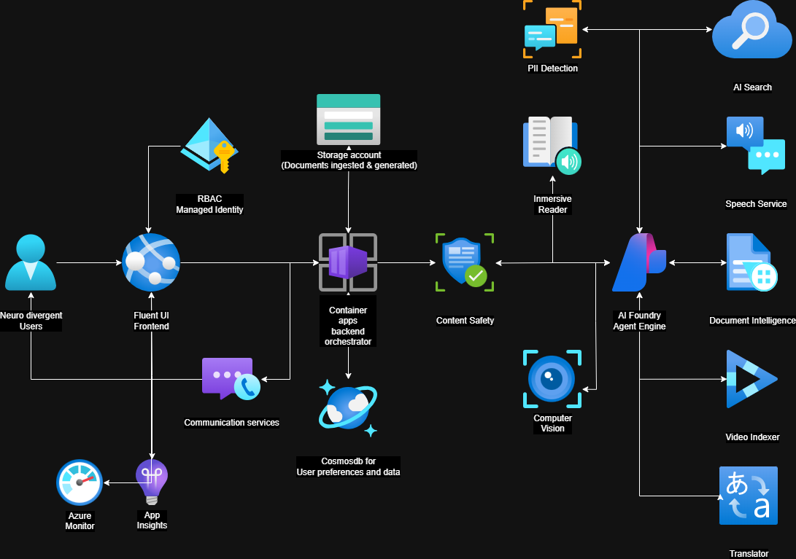

# Architecture

## High-Level Overview

The application is a production-grade voice and text AI assistant built on the **Azure AI Foundry Agent Framework**. Azure Static Web Apps serves the React/TypeScript frontend; Azure Container Apps (Consumption plan) runs the Python FastAPI backend. The backend exposes HTTP endpoints for text chat and session management. Real-time voice uses the **Azure AI Voice Live SDK** (`azure-ai-voicelive`) connected to a **Foundry Agent**, with **Azure Web PubSub** providing the real-time transport layer (because Azure Static Web Apps cannot proxy WebSocket connections to linked backends).

### Key SDK Stack

| Layer | SDK / Service | Package |
|-------|--------------|---------|
| Agent Framework | Azure AI Projects (`AIProjectClient`, `PromptAgentDefinition`) | `azure-ai-projects>=2.0.0b3` |
| Voice (real-time) | Azure AI Voice Live SDK | `azure-ai-voicelive>=1.2.0b4` |
| Real-time transport | Azure Web PubSub Service | `azure-messaging-webpubsubservice` |
| Text chat (Assistants) | OpenAI Assistants API via Azure OpenAI | `openai` |
| Content Safety | Azure AI Content Safety | `azure-ai-contentsafety` |
| Auth | Managed Identity + Entra ID | `azure-identity` |

## Service Topology



## Compute: Why Azure Container Apps

The voice interaction requirement drives the compute choice. Voice Live sessions can last up to 30 minutes and the backend must maintain persistent connections to both Web PubSub (CloudEvent callbacks) and the Voice Live service.

| Hosting Option | WebSocket Support | Max Session | Idle Cost | Decision |
|---|---|---|---|---|
| **Azure Functions (Consumption)** | Limited — 5–10 min timeout kills voice sessions | ~10 min | $0 | Eliminated |
| **Azure App Service (B1)** | Yes, manual enable required | Unlimited | ~$13/mo | Too costly for dev |
| **Azure Container Apps (Consumption)** | Native HTTP ingress + CloudEvent handlers | Unlimited | $0 (scale to zero) | **Chosen** |

Additional advantages of Container Apps:
- KEDA HTTP autoscaling — scales to zero at idle, scales out on concurrency
- Managed identity for Container Registry image pull (`AcrPull` role) — no admin credentials
- Consumption plan billing: ~$0.000024/vCPU-second (pay only when active)
- Full container flexibility: any Python version, any system dependency

## Voice Protocol: Web PubSub + Voice Live + Foundry Agent

Real-time voice uses a three-layer architecture because Azure Static Web Apps cannot proxy WebSocket connections to linked backends:

```
Browser ←WebSocket→ Azure Web PubSub ←CloudEvent HTTP→ Container App ←Voice Live SDK→ Foundry Agent
```

The voice flow operates in five phases:

**1 — Negotiate (client requests access URL)**
```
POST /api/voice/negotiate
Authorization: Bearer <entra_jwt>
→ { "url": "wss://webpubsub-kvhky.webpubsub.azure.com/client/hubs/voice?access_token=..." }
```
The backend validates the JWT via `auth/entra.py`, then generates a Web PubSub client access URL with the user's ID embedded as a claim.

**2 — Web PubSub Connection (client connects directly)**
The browser connects to Web PubSub via the returned URL. Web PubSub forwards all client events to the Container App as CloudEvent HTTP callbacks at `POST /api/webpubsub/voice`.

**3 — Voice Live Session (server opens on `connected` event)**
When the backend receives the `connected` CloudEvent, it opens a Voice Live session to the Foundry Agent:
```python
async with voicelive_connect(
    endpoint=VOICELIVE_ENDPOINT,
    credential=AsyncDefaultAzureCredential(),
    api_version="2026-01-01-preview",
    agent_config=get_voicelive_agent_config(),  # Foundry agent name + project
) as vl_conn:
    calm_session = build_calm_session_request()
    await vl_conn.session.update(session=calm_session)
```
The agent config references the `CopilotCLR-SpeechAssistant` agent deployed to Azure AI Foundry via `AIProjectClient.agents.create_version()` with `PromptAgentDefinition`.

**4 — Calm Voice Session Configuration**
The Voice Live session is configured with neurodiverse-friendly settings:
- **Voice**: `en-US-Ava:DragonHDLatestNeural` (Azure Standard, temperature 0.5 for measured delivery)
- **Turn detection**: Azure Semantic VAD (multilingual) — waits for natural pauses rather than volume thresholds
- **Noise handling**: Azure Deep Noise Suppression + Server Echo Cancellation
- **Interim responses**: Low-latency calming interim responses while processing

**5 — Bidirectional Relay**
- Client audio → Web PubSub → CloudEvent → Backend → `vl_conn.input_audio_buffer.append()`
- Voice Live response audio/text → Backend → `send_to_connection()` → Web PubSub → Client
- Content Safety runs on transcripts before forwarding to the client
- Barge-in support: client sends cancel → `vl_conn.response.cancel()`

**6 — Ready Signal (server to client via Web PubSub)**
```json
{ "type": "ready", "userId": "<oid>" }
```

## Data Flow: Text Chat Request

```
Client  ->  POST /api/chat  ->  Container App  (backend/main.py)
                                |  validate JWT               (auth/entra.py)
                                |  Content Safety input check  (_check_content_safety)
                                |  write user message -> Cosmos DB  (partition key: userId)
                                |  call Azure OpenAI Assistants API  (agents/chat_agent.py)
                                |    -> _get_openai_client_sync() — AzureOpenAI with MI token
                                |    -> _ensure_assistant_sync() — create/retrieve "Copilot CLRAssistant"
                                |    -> _get_or_create_thread_sync() — thread ID persisted in Cosmos DB
                                |    -> _run_assistant_sync() — gpt-4o-mini inference
                                |  Content Safety output check (_check_content_safety)
                                |  write assistant message -> Cosmos DB
                                |  log latency -> stdout (→ Log Analytics AppTraces)
                                +- 200 JSON {sessionId, message, meta.latencyMs}
```

## Data Flow: Speech Chat Request (Foundry Agent)

```
Client  ->  POST /api/speech/chat  ->  Container App  (backend/main.py)
                                       |  validate JWT
                                       |  Content Safety input check
                                       |  call Foundry Agent Service   (agents/speech_agent.py)
                                       |    -> AIProjectClient(endpoint=PROJECT_ENDPOINT, credential=MI)
                                       |    -> _ensure_agent_sync() — PromptAgentDefinition + Voice Live metadata
                                       |    -> _run_agent_chat_sync() — Foundry conversation API:
                                       |         client.get_openai_client().conversations.create()
                                       |         responses.create(input=msg, conversation=conv_id,
                                       |           extra_body={"agent_reference": {"name": agent, "type": "agent_reference"}})
                                       |    -> Calm TTS via Azure Speech SDK (SSML with calm style + slow rate)
                                       |  Content Safety output check
                                       +- 200 JSON {sessionId, message, audio_base64, meta.latencyMs}
```

## Data Flow: Real-time Voice (Web PubSub + Voice Live)

```
Browser  ->  POST /api/voice/negotiate  ->  Web PubSub client access URL
Browser  <-WebSocket->  Azure Web PubSub (wss://webpubsub-*.webpubsub.azure.com)
                           |  connected event (CloudEvent HTTP)  ->  Container App
                           |    -> voicelive_connect(endpoint, credential, agent_config)
                           |    -> VoiceSession.start() → session.update(calm_session)
                           |
                           |  client audio → CloudEvent → forward_audio() → vl_conn.input_audio_buffer.append()
                           |  Voice Live response → send_to_connection() → Web PubSub → Browser
                           |  Content Safety on transcripts before forwarding
                           |  Barge-in → cancel_response() → vl_conn.response.cancel()
                           |
                           |  disconnected event  ->  VoiceSession.stop()
```

All Cosmos DB calls use the partition key (`userId`) — no cross-partition queries.

## Security Architecture

### Zero-Secret Pattern

No connection strings, API keys, or passwords exist in the codebase or Bicep parameter files.
Every service-to-service call uses a managed identity bearer token from `DefaultAzureCredential`.
The Foundry Account (`Microsoft.CognitiveServices/accounts` kind `AIServices`) is provisioned via `infra/foundry-agent-setup.bicep` with `disableLocalAuth: false` (Entra-first, key fallback for SDK compatibility).

### RBAC Matrix (defined in `infra/modules/security.bicep`)

| Principal | Target Service | Role | Purpose |
|---|---|---|---|
| Container App MI | Container Registry | AcrPull | Pull Docker image without admin credentials |
| Container App MI | Cosmos DB | Contributor + data-plane RBAC | Session and message CRUD |
| Container App MI | Storage | Blob Data Contributor | File storage operations |
| Container App MI | Key Vault | Secrets User | Runtime secret access |
| Container App MI | Azure OpenAI | Cognitive Services OpenAI User | LLM inference (Assistants API) |
| Container App MI | AI Search | Index Data Contributor + Service Contributor | Knowledge base queries + indexing |
| Container App MI | AI Services (Foundry) | Cognitive Services User | Content Safety, PII detection |
| Container App MI | Service Bus | Data Owner | Async task dispatch |
| Container App MI | AI Foundry Project | Azure ML Data Scientist | Agent Service invocation (PromptAgentDefinition) |
| Container App MI | Speech Service | Cognitive Services User | TTS synthesis + speech token issuance |
| Container App MI | Immersive Reader | Cognitive Services User | IR token issuance |
| Container App MI | Web PubSub | Web PubSub Service Owner | Generate client access URLs + send to connections |
| Foundry Account MI | OpenAI | OpenAI User | Foundry-connected inference |
| Foundry Account MI | Storage | Blob Data Contributor | Foundry artifact storage |
| Foundry Account MI | Key Vault | Secrets User | Foundry secret access |
| Foundry Project MI | OpenAI | OpenAI User | Agent deployment inference |

### Auth Flow: User Requests

1. User authenticates with Microsoft Entra ID (MSAL in browser)
2. Browser sends `Authorization: Bearer <jwt>` on every API call and WebSocket handshake
3. Container App validates JWT signature (JWKS from Entra), audience, and issuer
4. User OID extracted from claims — becomes the Cosmos DB partition key

## Scalability Analysis

| Load Level | Container App Behaviour | Bottleneck | Mitigation |
|---|---|---|---|
| 1–5 concurrent users | 1 replica, 0.5 vCPU, 1 GiB | None | — |
| 10x (50 users) | KEDA scales to ~3 replicas (HTTP concurrency >= 20) | Cosmos DB RU/s | Serverless auto-scales |
| 100x (500 users) | ~15 replicas (raise maxReplicas in Bicep) | Azure OpenAI TPM (50 capacity) | Increase TPM cap in `foundry-agent-setup.bicep` |
| Voice at scale | 1 Voice Live session per Web PubSub connection (~20 voice sessions/replica) | Voice Live concurrency | Horizontal replica scale |

## Agent Architecture (9 Agents, 3 Workflows)

The application runs **9 specialized AI agents** organized into 3 workflows. All agents use the Microsoft Agent Framework SDK (`agent-framework-azure-ai` 1.0.0rc3) with Azure AI Foundry.

### Agent Inventory

| # | Agent Name | File | Triggering Route | Purpose |
|---|-----------|------|------------------|---------|
| 1 | **Copilot CLRAssistant** | `agents/chat_agent.py` | `POST /api/chat` | Fallback direct chat via OpenAI Assistants API (when only `AZURE_OPENAI_ENDPOINT` is set) |
| 2 | **CopilotCLR-Workflow** | `agents/workflow.py` | `POST /api/chat` | Main conversational agent with tools: document search, web search, task management, goal decomposition, conversation history |
| 3 | **CopilotCLR-RequestBuilder** | `agents/content_workflow.py` | `POST /api/content/process`, `POST /api/content/build-request` | Stage 2 of content pipeline — builds structured content request from chat or form input |
| 4 | **CopilotCLR-ContentAdapter** | `agents/content_workflow.py` | `POST /api/content/process` | Stage 3 of content pipeline — adapts content to target reading level with optional web-search enrichment |
| 5 | **CopilotCLR-TaskPlanner** | `agents/content_workflow.py` | `POST /api/content/process` | Stage 4 of content pipeline — decomposes adapted content into micro-steps with time estimates and focus tips |
| 6 | **CopilotCLR-AudiobookScripter** | `agents/content_workflow.py` | `POST /api/content/process` | Stage 5 of content pipeline — converts adapted content into spoken narration script for TTS synthesis |
| 7 | **Copilot-CLR-Task-Decomposer** | `agents/task_decomposer.py` | `POST /api/tasks/plans/decompose` | Standalone goal decomposition — breaks complex goals into time-boxed, prioritized sub-tasks |
| 8 | **CopilotCLR-SpeechAssistant** | `agents/speech_agent.py` | `POST /api/speech/chat`, `WS /ws/realtime` | Voice conversation agent with calm TTS delivery via Azure Speech and Voice Live SDK |
| 9 | **CopilotCLR-Simplifier-{grade}** | `services/content_adapter.py` | `POST /api/content/simplify`, `POST /api/content/{id}/adapt` | Dynamic per-grade-level content simplification (e.g., Simplifier-2, Simplifier-5, Simplifier-8) |

### Workflow 1: Chat

```
POST /api/chat
  → main.py:chat()
  → get_agent_response()                         # chat_agent.py
    ├─ [if PROJECT_ENDPOINT] → run_workflow()     # Agent #2 (CopilotCLR-Workflow)
    │    tools: search_documents, web_search, manage_tasks, decompose_goal
    │    context_providers: CosmosDBHistoryProvider, UserMemoryProvider
    └─ [fallback]            → Assistants API     # Agent #1 (Copilot CLRAssistant)
```

### Workflow 2: Content Processing Pipeline

Sequential 4-stage multi-agent workflow triggered by `POST /api/content/process`:

```
User input
  → Stage 1: IntakeExecutor (no agent — validation + text extraction)
  → Stage 2: Agent #3 (RequestBuilder) — structures the content request
  → Stage 3: Agent #4 (ContentAdapter) — rewrites to target reading level
  → Stage 4: Agent #5 (TaskPlanner) — decomposes into micro-steps  [if requested]
  → Stage 5: Agent #6 (AudiobookScripter) — generates TTS script   [if requested]
```

### Workflow 3: Speech + Voice

```
POST /api/speech/chat
  → main.py:speech_chat()
  → get_speech_agent_response()                   # Agent #8 (CopilotCLR-SpeechAssistant)
       context_providers: CosmosDBHistoryProvider, UserMemoryProvider
       TTS: Azure Speech SDK (JennyNeural calm voice, slow rate)

WS /ws/realtime (Voice Live)
  → Web PubSub CloudEvent → voicelive_connect()   # Agent #8 via Voice Live SDK
       voice: en-US-Ava:DragonHDLatestNeural
       VAD: Azure Semantic (multilingual)
```

### Standalone Simplification

```
POST /api/content/simplify           → Agent #9 (CopilotCLR-Simplifier-{grade})
POST /api/content/{id}/adapt         → Agent #9 (CopilotCLR-Simplifier-{grade})
POST /api/tasks/plans/decompose      → Agent #7 (Copilot-CLR-Task-Decomposer)
```

### Text Chat Agent Detail (`backend/agents/chat_agent.py`)

Uses the **Azure OpenAI Assistants API** (`openai` SDK with `AzureOpenAI` client):
- **Agent**: `Copilot CLRAssistant` — created/retrieved via `client.beta.assistants.create()`
- **Model**: `gpt-4o-mini` via Azure OpenAI deployment
- **Thread persistence**: Thread IDs stored in Cosmos DB `sessions` container; survives pod restarts
- **Tools**: `get_current_time`, `search_knowledge_base` (Azure AI Search), `simplify_text`
- **All sync SDK calls** wrapped in `asyncio.to_thread()` to avoid blocking FastAPI's event loop

### Speech Agent Detail (`backend/agents/speech_agent.py`)

Uses the **Azure AI Foundry Agent Service** (`azure-ai-projects` SDK with `AIProjectClient`):
- **Agent**: `CopilotCLR-SpeechAssistant` — created via `agents.create_version()` with `PromptAgentDefinition`
- **Voice Live metadata**: Calm voice configuration stored in agent metadata (chunked to 512-char limit per key)
- **Conversation persistence**: Foundry conversation IDs stored in Cosmos DB `sessions` container (`speechConversationId` field)
- **Conversation API**: `client.get_openai_client().conversations.create()` + `responses.create(input=msg, conversation=conv_id, extra_body={"agent_reference": {...}})`
- **TTS**: Azure Speech SDK with calm SSML (JennyNeural calm style, slow rate) as base64 audio

### Foundry Infrastructure (`infra/foundry-agent-setup.bicep`)

- **Foundry Account**: `Microsoft.CognitiveServices/accounts` kind `AIServices` (S0)
- **Project**: `Microsoft.CognitiveServices/accounts/projects` — child resource of the Foundry Account
- **Model deployment**: `gpt-4o-mini` (GlobalStandard, capacity 50)
- **SDK compatibility note**: Hub-based projects (`Microsoft.MachineLearningServices`) are incompatible with `azure-ai-projects >= 2.0.0b3`; this project uses the newer Foundry Account pattern

## TODO Before Submission

- [ ] Export architecture diagram to `docs/assets/architecture-diagram.png` using Azure Architecture Icons
- [ ] Add PII detection on all user-submitted text before Cosmos DB write
- [ ] Add custom latency metric emission to App Insights for voice session paths
